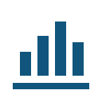
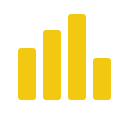
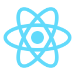
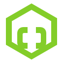

# 👋 Hi, I'm Subham Das

### 🤖 Aspiring Machine Learning Engineer | AI • Data Science • Python

I'm a **Computer Science & Engineering student** passionate about **Artificial Intelligence, Machine Learning, Data Science, and Software Development**.

I enjoy learning new technologies, solving problems with code, and transforming ideas into practical, data-driven solutions.

---

## 🧠 About Me

* 🎓 **B.Tech in Computer Science & Engineering**
* 🤖 Focused on **Artificial Intelligence & Machine Learning**
* 📊 Interested in **Data Science & Data Analytics**
* 🐍 Python-focused developer
* 🌐 Exploring **Full-Stack Development**
* 🧠 Interested in **Deep Learning, Computer Vision & NLP**
* ✨ Exploring **Generative AI & Agentic AI**
* 🚀 Interested in building and deploying practical AI applications
* 📚 Continuously learning through hands-on projects and experimentation

---

# 🛠️ Tech Stack

## 💻 Programming Languages

<table>
<tr>
<td align="center" width="120">

<br> <b>Python</b>

</td>

<td align="center" width="120">

<br> <b>Java</b>

</td>

<td align="center" width="120">

<br> <b>C</b>

</td>

<td align="center" width="120">

<br> <b>JavaScript</b>

</td>
</tr>
</table>

---

## 🤖 AI / Machine Learning

<table>
<tr>
<td align="center" width="140">

<br> <b>TensorFlow</b>

</td>

<td align="center" width="140">

<br> <b>PyTorch</b>

</td>

<td align="center" width="140">

<br> <b>Scikit-learn</b>

</td>
</tr>
</table>

**Core Areas**

`Machine Learning` • `Deep Learning` • `Computer Vision` • `NLP` • `Feature Engineering` • `Model Evaluation`

---

## 📊 Data Science & Analytics

<table>
<tr>
<td align="center" width="130">

<br> <b>Pandas</b>

</td>

<td align="center" width="130">

<br> <b>NumPy</b>

</td>

<td align="center" width="130">

<br> <b>Matplotlib</b>

</td>

<td align="center" width="130">

<br> <b>Power BI</b>

</td>
</tr>
</table>

**Areas**

`Data Analysis` • `EDA` • `Data Visualization` • `Statistical Analysis`

---

## 🌐 Web Development

<table>
<tr>
<td align="center" width="120">

<br> <b>HTML</b>

</td>

<td align="center" width="120">

<br> <b>CSS</b>

</td>

<td align="center" width="120">

<br> <b>JavaScript</b>

</td>

<td align="center" width="120">

<br> <b>React</b>

</td>

<td align="center" width="120">

<br> <b>Node.js</b>

</td>
</tr>

<tr>

<td align="center">

<br> <b>Express</b>

</td>

<td align="center">

<br> <b>MongoDB</b>

</td>

</tr>
</table>

---

## 🔧 Tools & Platforms

<table>
<tr>
<td align="center" width="120">

<br> <b>Git</b>

</td>

<td align="center" width="120">

<br> <b>GitHub</b>

</td>

<td align="center" width="120">

<br> <b>VS Code</b>

</td>

<td align="center" width="120">

<br> <b>Jupyter</b>

</td>

</tr>

<tr>

<td align="center">

<br> <b>Google Colab</b>

</td>

<td align="center">

<br> <b>Kaggle</b>

</td>

<td align="center">

<br> <b>Streamlit</b>

</td>

</tr>
</table>

---

# 🎯 Current Focus

```text
Artificial Intelligence
Machine Learning
Deep Learning
Computer Vision
Natural Language Processing
Generative AI
Agentic AI
MLOps & Model Deployment
Data Analytics
```

---

# 📚 Learning Philosophy

### Learn → Build → Test → Deploy → Improve

I believe that consistent learning, hands-on practice, and real-world problem solving are the foundation of becoming a better engineer.

---

# 💼 Career Goal

> **To become a skilled Machine Learning Engineer and contribute to building intelligent, scalable, and impactful AI-powered solutions.**

---

# 🌱 What I'm Working Towards

* Building stronger Machine Learning fundamentals
* Developing practical Deep Learning solutions
* Exploring modern AI technologies
* Improving model deployment skills
* Understanding production-oriented ML workflows
* Continuously improving software engineering practices

---

# 🤝 Let's Connect

<p>
  <a href="https://www.linkedin.com/in/subham-das-a316422b4">
    
  </a>
  &nbsp;&nbsp;
  <a href="https://github.com/DasSubham-2005">
    
  </a>
</p>

**LinkedIn:** [subham-das-a316422b4](https://www.linkedin.com/in/subham-das-a316422b4)

**GitHub:** [DasSubham-2005](https://github.com/DasSubham-2005)

---

<p align="center">

### 🚀 Learn. Build. Innovate.

**Thanks for visiting my profile!**

</p>

